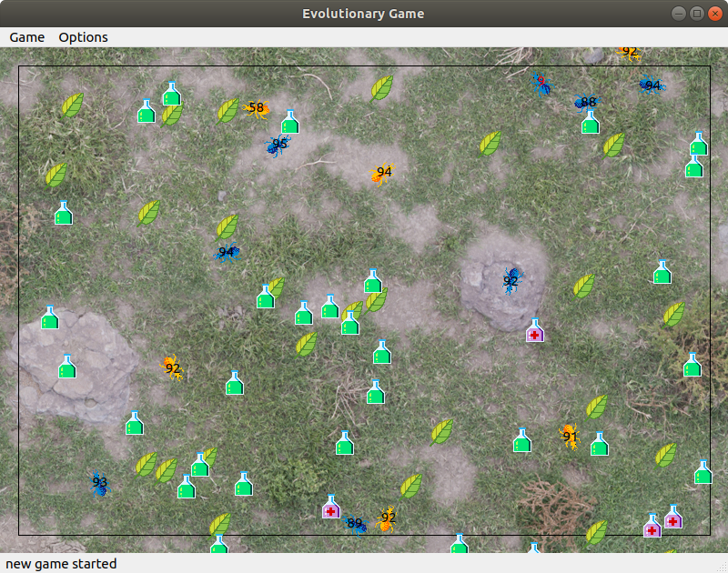
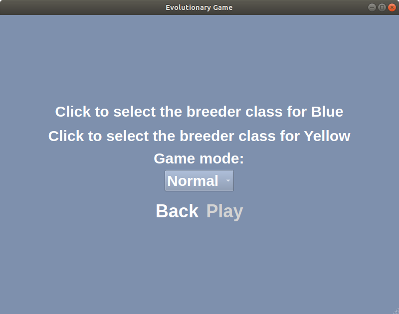
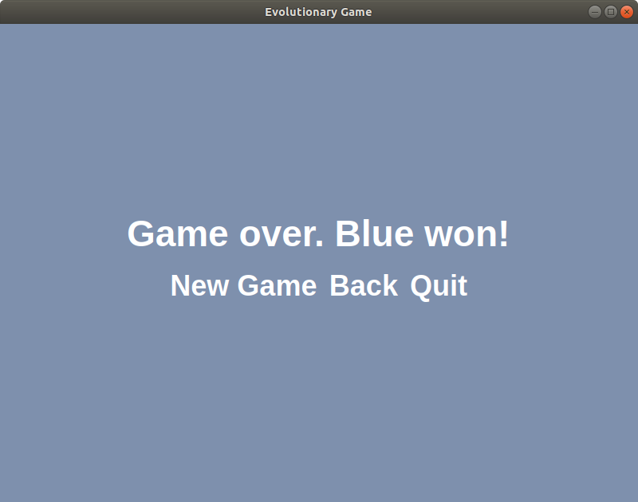

My private fork of https://github.com/digital-bauhaus/EGame/tree/gui_rework.

# EGame
---
# Description
EGame is a competitive evolutionary game designed by the research group Intelligent Software Systems at Bauhaus University Weimar.
Two populations compete to survive in a changing environment.
Endangered by extinction, hunting predators, and other factors.



# Requirements
- Python3
- Qt5
- PyQt5
- numpy

# Install Requirements
## With Packet Managers
### Ubuntu
```
sudo apt update
sudo apt install python3 python3-pip
pip3 install PyQt5 numpy
```

### Arch Linux
```
sudo pacman -S python python-pip # installs python3
pip3 install PyQt5 numpy
```

### Windows
```
# make sure you have python3 and pip3 installed
# open a console and run this:
pip install numpy pyqt5
```

### With Anaconda
- [Install Anaconda on your system](https://www.anaconda.com/download)
- make sure Anaconda has [numpy](https://anaconda.org/conda-forge/numpy) and [pyqt5](https://anaconda.org/dsdale24/pyqt5) installed

# Run the Game

```
./run.sh
```
or
```
python3 main.py <config>
# e.g:
python3 main.py config.json 
```
# Start a new Game
<br>
To start a new game, press *Play new game* in the main menu and, in the next screen, select the two breeder classes that should play against each other by pressing the buttons. A file selector will appear. When both classes are selected, you can play.

# Game Elements
## Individuals of populations
<br>
Populations consist of individuals which have certain traits, abilities and perceptions.
To survive, an individual has to eat something; for example, food, poison, heal potions and corpses.
They can attack individuals of other populations (but no predators) or be attacked by individuals of other populations or predators.
If an individual dies, it creates a corpse at the position where it died which can be eaten by other individuals.

Each individual has its own desires:
- seek food
- dodge poison
- seek opponents
- dodge predators
- seek heal potions
- seek corpses

All desires have a value between 0 and 1 and the sum of all desires has to be 1 in order to have the ability to specialize on certain desires.
That means, if an individual has a desire to dodge poison at 1, it will do anything to dodge the poison even if it gets eaten by opponents or predators since all other desires are at 0.

Additionally, each individual has a perception.
A perception is defined as a radius around the respective individual.
For each desire, there is also a perception:
- food perception
- poison perception
- opponent perception
- predator perception
- heal potion perception
- corpse perception

Again, each perception is a value between 0 and 1 and the sum of all perceptions has to be 1.
This sum represents an amount of pixel which can be adjusted in the configuration file and all perception values are fraction of it.

Furthermore, individuals have certain abilities (values from 0 to 1, sum = 1):
- increased armor (reduce the damage taken by opponents / predators)
- increased speed (increase own maximum speed)
- increased strength (increase damage dealt to opponents)
- poison resistance (reduce damage taken by poison)
- toxicity (deal damage to attacking opponent / predator)


After a defined amount of frames, new individuals are bred into the populations based on user defined genetic algorithms.
Bad performing individuals die due to natural selection and good performing individuals survive, enabling them to multiply.

## Predators
<br>
Predators are individuals which follow a defined rule set.
All have the same perception radius to seek individuals of the player populations and corpses.
In addition, they desire to seek individuals and corpses equally.

## Items
### Food
<br>
Food only increases health points of individuals who eat it.

### Poison
<br>
Poison increases the internal toxicity of an individual.
The more poison an individual eats, the faster its health decreases.

### Heal Potions
<br>
Health potions reset the poison count and increase the health by a small amount.

### Corpses
<br>
Corpses are like food, only that they contain a fraction of the poison of the dead individual.

# Task
Write your own *Breeder* class to define the breeding of your population.
You know, a genetic algorithm consits of these parts: initialization, selection, copy, crossover, mutation.


This class should implement two interfaces: *initialize_population* and *breed*.
*Initialize* will get the number of individuals a population can have at maximum and the color of the population.
It should return a (python) list of individuals.
*breed* will get the current population (consisting of living and dead individuals) and should, again, return a population after the breeding procedure.

An example can be found at [genetic_algorithm/breeder.py](./genetic_algorithm/breeder.py)


Each individual has a *get_dna()* method to access its current traits.
You should come up with your own *assess_fitness* method, which defines what makes up a good and a bad individual.

You can pass the new dna created by your genetic algorithm to the constructor of a new individual.


You are allowed to use the dna of a deceased individual, too.
(Keep in mind that new individuals should spawn at the position of a surviving individual and not somewhere on the playground)

Follow this template to create your own breeder class:
```
class Breeder:
	def __init__(self, parent):
		self.parent = parent
	def initialize_population(self, num_individuals, color):
		# your code here
		return population
	def breed(self, population):
		# your code here
		return updated_population
```


# Goal of the Game
<br>
Let your population survive longer than the population of your opponent!
If all individuals of a population are dead, the round ends and the surviving population wins!
